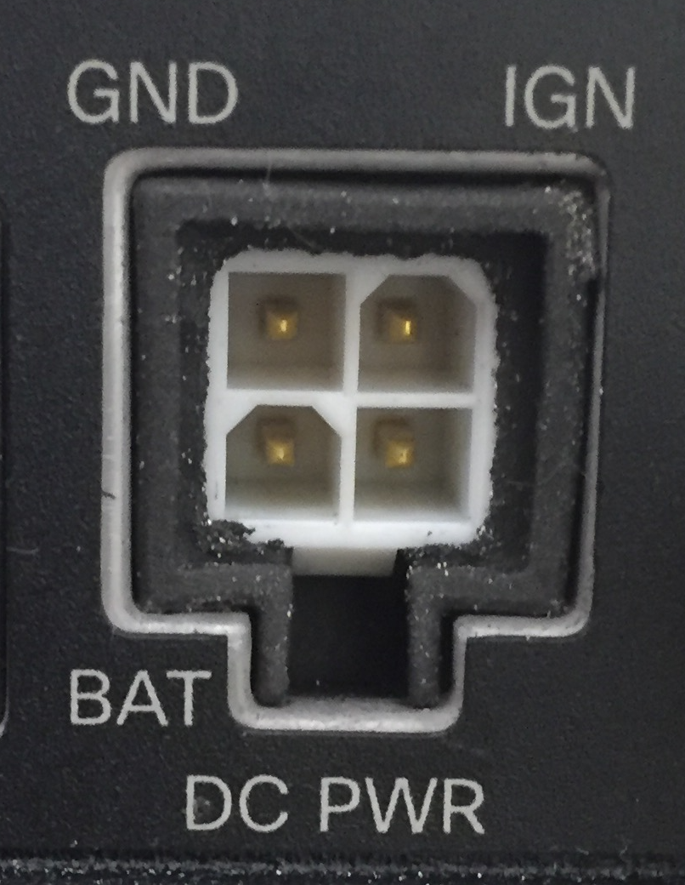
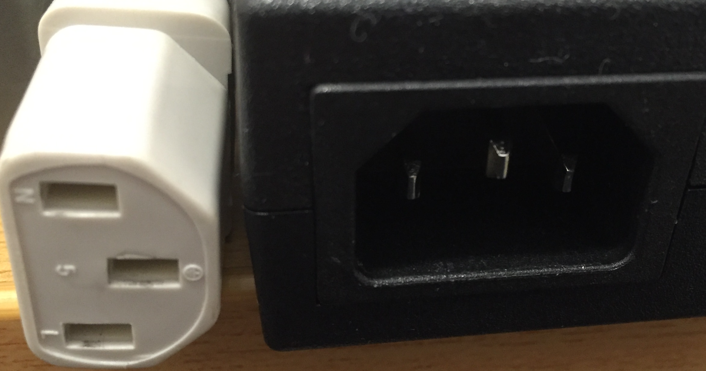
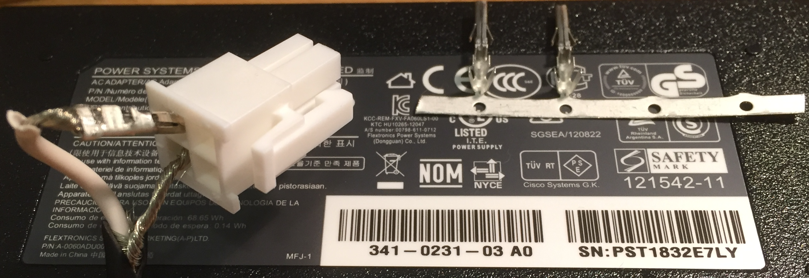
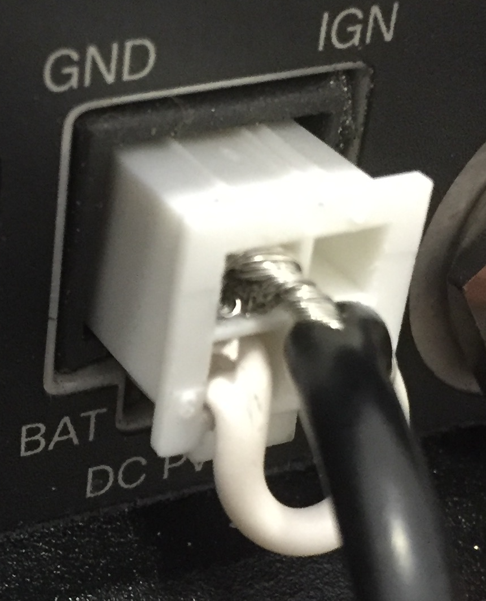
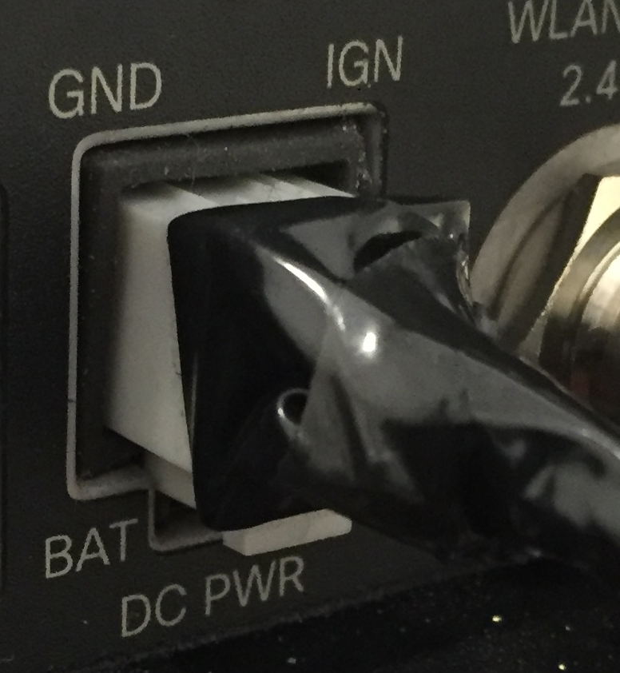

#How to Provide Power to Your IR829

When I received my [IR829](http://www.cisco.com/c/en/us/td/docs/routers/access/800/829/hardware/install/guide/829hwinst/pview.html) I opened the box with the expectation of
taking it out, plugging it and starting to work with it. BUT, it was
not shipped with a Power Supply Unit (PSU) or adaptor, so I was somewhat
disappointed instead.

If that happens to you, then what I have written here may help you.

##What the IR829 is Supposed to do for Power

The IR829, as originally conceived, was designed to go into
vehicles. To make that simple, it comes with an on-board power adapter
suitable for the 12v-24v DC power supply that is standard in
vehicles. This makes perfect sense for the original intended use.

Note that "GND" is ground, i.e. power out -ve, and that "BAT" is battery, which
is the power in +ve. IGN is the ignition connector. This is explained,
sort of,
[here](http://www.cisco.com/c/en/us/td/docs/routers/access/800/829/hardware/install/guide/829hwinst/pview.html#pgfId-1077228),
but with reference to a non-existent "DC Power section".

Outside of the vehicle environment, though, 12v-24v, 5A, 60-120W power
sources are not that common.

##The Alternatives

Cisco has two part numbers for suitable PSUs: PWR-60W-AC=, and
PWR-125W-AC=. The former supplies 60W, which is sufficient for the
IR829, and the latter supplies 125W, which is sufficient for Power
over Ethernet (PoE) also.

This is what the PWR-60W-AC= looks like:

Note that the plug at the end is *not* a Molex. We will get to that momentarily.

They both connect to 100-240V outlets common in North
America or EMEA. Note that the PSU ships *without* a cable to connect
to a wall socket. This is what you will need:

##Some Hacking Required

In the box with the IR829 I did find a four hole Molex plug and a strip of four
metal pieces designed to clamp around cables and insert into the Molex
plug. These are intended to be used to connect power cables in a
vehicle environment to plug into the IR829. With a little work, they
can be adapted for use with a AC/DC PSU also.

What I did
was cut off the plug that the PSU came with, and used the metal pieces
in the IR829 box to connect the inner and outer cables into the Molex
plug, which also came in the IR829 box.

That looks like this (note
that the white cable that looks like it is going into the top of the Molex
slipped when I took the photo. It actually goes into the hole on the
right of the bare metal ground cable):

That, when fully pushed together, can be plugged in like this:

And the lights come on like this:

Once you are happy that it is all connected properly, tape it up like
this (or perhaps even tidier):

